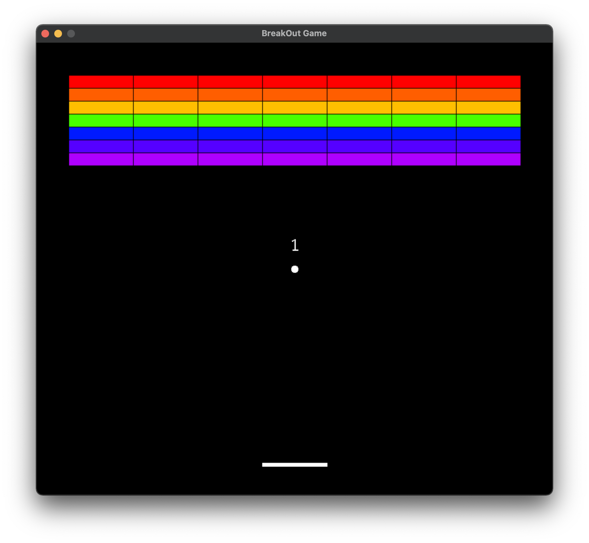
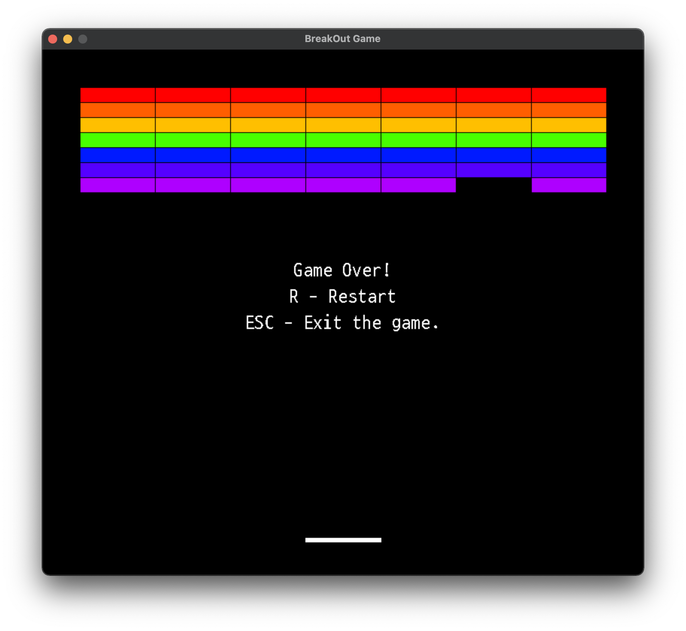
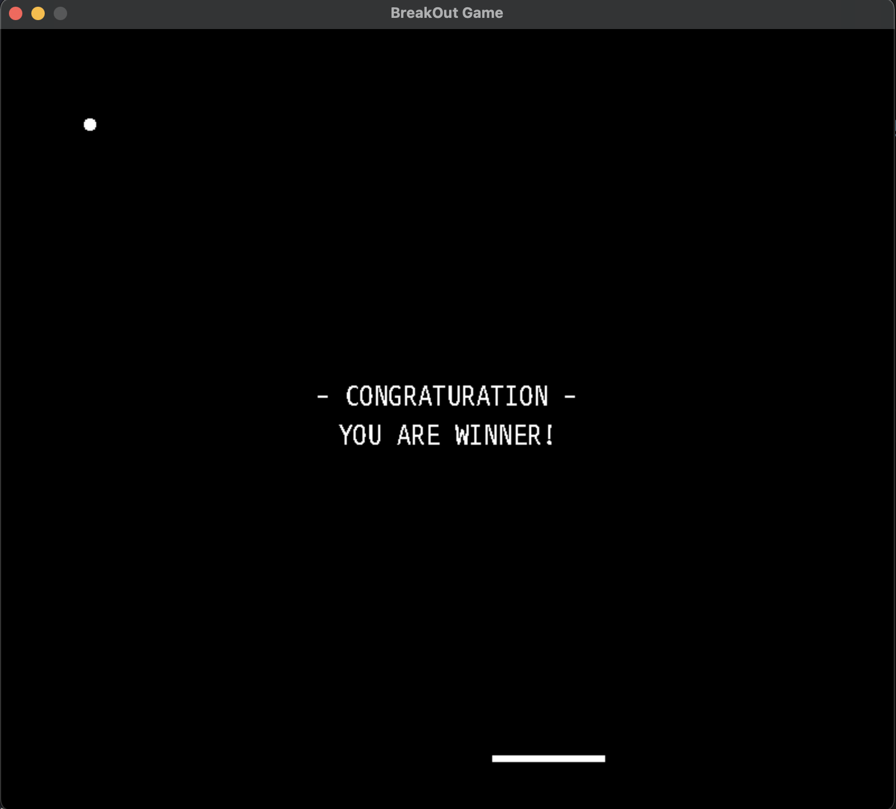
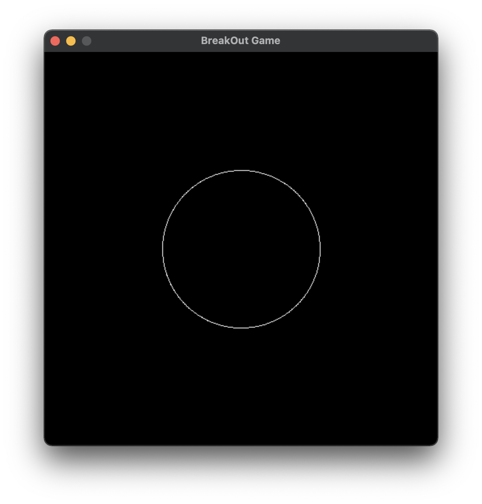
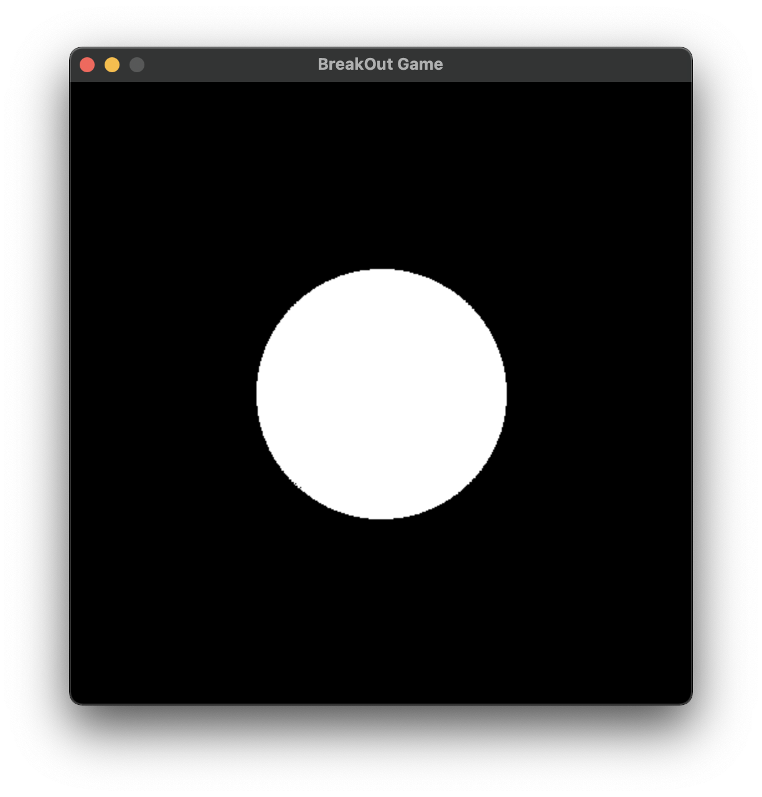
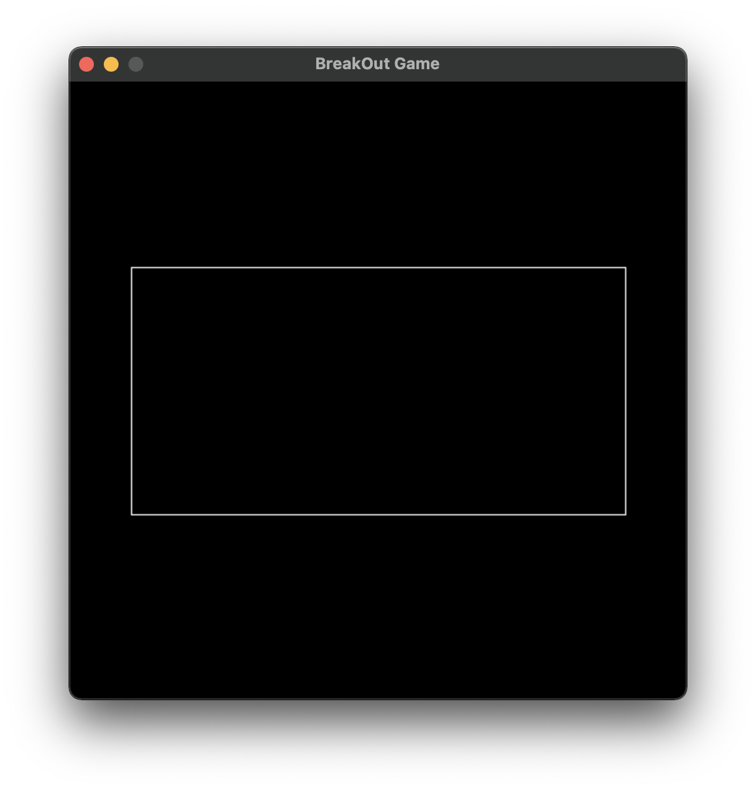
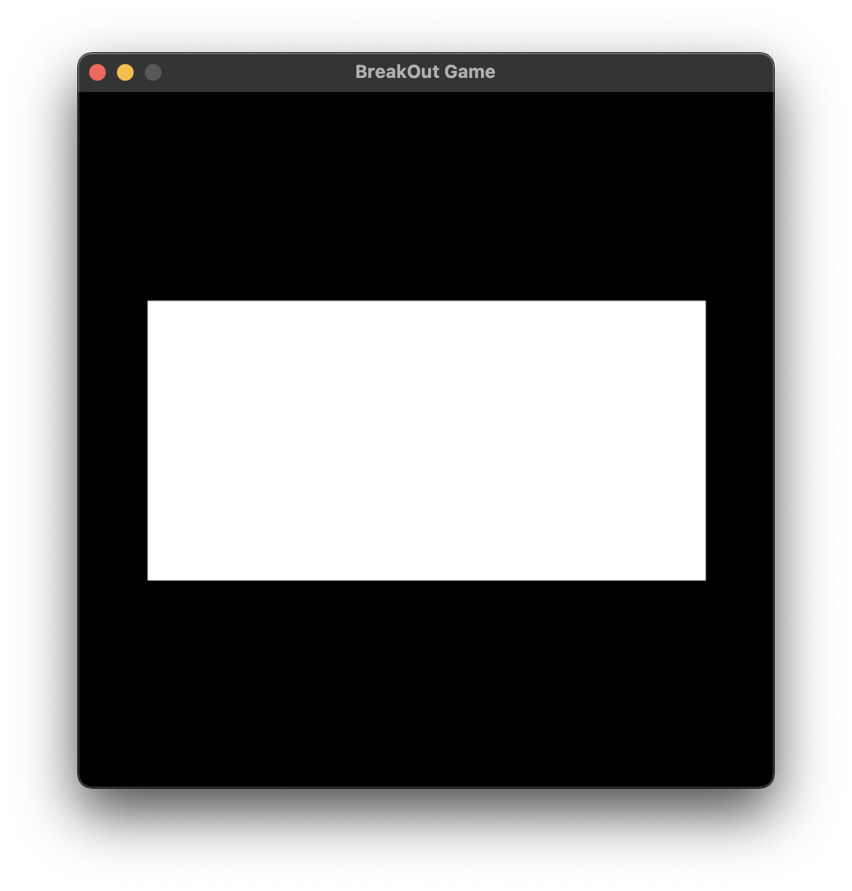

# 벽돌깨기 게임 (SDL2 C++11)

## 간단한 게임 소개
- 공을 쳐 올려서 모든 벽돌을 없애는 것을 목표로 하는 게임 입니다.
- 키보드 좌/우 방향키 혹은 A/D 키를 이용해서 조작할 수 있습니다.
- R키는 재시작, ESC키는 게임 종료 키 입니다.
- 다운로드 가능한 실행버전 링크를 따로 배포하지 않습니다. 직접 소스코드를 컴파일해서 실행해 주시기 바랍니다.
- Windows / Linux / Mac OSX 에서 사용 가능합니다.

<div style="display:flex;">
  
  
  
</div>

## 버그 혹은 소스코드 기여방법
- 기능개선이나 버그는 Github Issues에 남겨주세요. 검토후에 반영됩니다.
- 소스코드를 기여하실 분들은 브런치 분리해서 Pull Requests에 올려주세요. 코드 리뷰 후 반영됩니다.
- Github flow로 개발이 진행됩니다. (자세한 내용은 [여기서](https://guides.github.com/introduction/flow/) 참고하세요!)

## SDL2 설치방법 (Homebrew)
```bash
$ brew install sdl2 sdl2_image sdl2_mixer sdl2_ttf

$ brew list | grep sdl
sdl2
sdl2_image
sdl2_mixer
sdl2_ttf
```

## 소스코드 사용 및 컴파일 방법
```bash
$ git clone https://github.com/yejun614/breakout-sdl.git
$ cd breakout
$ make
$ ./bin/game.out
```

## 개발자의 한마디
> 2021-06-15  
> 코로나19 상황에 힘들게 군대에서 휴가를 나오게 되었습니다.  
> 하지만 정작 갈곳은 없고... 결국 집에서 코딩하다가 벽돌깨기 게임을 만들었습니다.  
> 이 프로젝트는 제가 C++ 로 만든 첫 게임이라고 할 수 있습니다.  
> SDL를 기반으로 단순하지만 재미있는 벽돌깨기 게임을 개발해 보았습니다.  
>
> 말이 길어지지만 README 안에 게임을 만들면서 고민했던 알고리즘과 원리를 조금 적어봤습니다.  
>저랑 비슷한 고민하시는 분들도 계실텐데, 부디 부족한 알고리즘 이지만 참고가 되시면 좋겠습니다.

## SDL2: Simple DirectMedia Layer
- [SDL 홈페이지](https://www.libsdl.org/)
- 크로스 플랫폼 게임 개발 엔진이라고 생각하시면 됩니다.
- 지금도 SDL을 기반으로 한 다양한 게임들이 만들어 지고 있습니다.

## 원을 그리는 방법
<div style="display:flex">
   
   
</div>

```
SDL에서는 원을 그리는 함수가 없습니다.
개발자가 직접 점을 찍어서 그려하는 하는데, 이번에 원을 그리는 방법을 알게 되어 공유합니다.

삼각함수인 SIN과 COS함수를 이용합니다.
원의 방정식인 (x-a)^2 + (y-b)^2 < r^2 에서
x값은 SIN함수에서, y값은 COS함수에서 얻을 수 있습니다.

중심좌표가 (a, b)이고 반지름이 r인 원의 외각을 표현하면 다음과 같이 됩니다.
x = a + (cos(t) * r)
y = b + (sin(t) * r)

여기서 t는 라디안 입니다. (0 <= t <= 2*PI)

아래는 utility/shapes.cpp 안에 draw_circle 함수 입니다.
t 값에 따라서 원의 외각좌표를 구해 점을 찍어나가는 모습을 볼수 있습니다.
```

```c++
void draw_circle(SDL_Renderer *renderer, float x, float y, float radius) {
  SDL_FPoint point;

  for (float t=0; t<2*M_PI; t+=SHAPE_DENSITY_RATE) {
    point.x = x + (cos(t) * radius);
    point.y = y + (sin(t) * radius);

    SDL_RenderDrawPointF(renderer, point.x, point.y);
  }
}
```

```
안이 채워진 원을 그리는 방법은 비교적 간단합니다.
원 외각선에 반지름을 조금씩 줄여나가면서 그리시면 됩니다.

utility/shapes.cpp 안에 draw_fillCircle 함수로 구현되어 있습니다.
```

## 직사각형을 그리는 방법
<div style="display:flex">
   
   
</div>

```
SDL에는 직사각형을 그리는 함수도 없었습니다.
그래서 직사각형도 직접 그려 봤습니다.

사각형의 4개의 꼭짓점을 이어서 그리고,
안이 채워진 사각형은 직선을 높이만큼 그려서 채웠습니다.

utility/shapes.cpp 안에 각자
draw_rect, draw_fillRect 함수로 구현되어 있습니다.
```

## 개발자
- 정예준 (yejun614@naver.com)

## 저작권 (소스코드 & 이미지)
- MIT License가 적용됩니다. 자유롭게 사용하셔도 괜찮습니다.
- utility 폴더 안에 보시면 유용한 코드들이 있습니다. 많이 활용해 주세요.

## 저작권 (폰트)
- [D2Coding](https://github.com/naver/d2codingfont) 폰트가 적용되었습니다.

## 저작권 (음원)
- Freesound.org 사이트에서 받았습니다.
- assets/audio/README.md 파일을 참고해 주세요.
